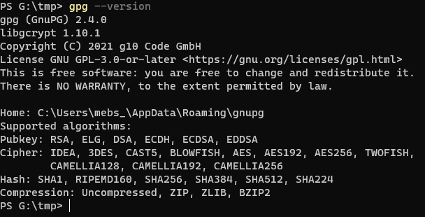

## SOPS - <u><i>S</i></u>ecrets-<u><i>OP</i></u>eration<u><i>S</i></u>
SOPS is a file editor/viewer that encrypts and decrypts files automatically.


### Installing SOPS on Ubuntu

#### Get the name of the latest release of SOPS. i.e. Look up github repo for the latest version. <br/>

`SOPS_LATEST_VERSION=$(curl -s "https://api.github.com/repos/mozilla/sops/releases/latest" | grep -Po '"tag_name": "v\K[0-9.]+')`


#### Use curl to download the latest .deb <br/>

`curl -Lo sops.deb "https://github.com/mozilla/sops/releases/latest/download/sops_${SOPS_LATEST_VERSION}_amd64.deb"`

#### Install sops.deb along with any missing dependencies</br>
`sudo apt --fix-broken install ./sops.deb`

#### Clean up download <br/>
`rm -rf sops.deb`

#### Test sops is working <br/>
`sops -version`

#### In case uninstall is needed <br/>
`sudo apt remove sops`


#### Web-Resources for installation
[SOPS install Instructions used](https://docs.technotim.live/posts/install-mozilla-sops/)

[AGE install Instructions used](https://docs.technotim.live/posts/install-age/)


### Using SOPS
Steps involved are

1. Generate public and private keys using AGE `age-keygen -o key.txt`

2. Move the keys file to `~/.sops` directory <br/>
```
mkdir ~/.sops
mv ./key.txt ~/.sops
```

3. Add ENV variables to shell configuration i.e. `~/.bashrc` file so the shell can find everything <br/>
```
export SOPS_AGE_KEY_FILE=$HOME/.sops/key.txt
export EDITOR=nano # Replace by your favorite editor
```
4. reload profile `source ~/.profile`

5. Create a test file<br/>
`$ echo "my-key: my-value" > config.yaml`

6. Encrypt the test file
`sops --encrypt --age $(cat ~/.sops/key.txt |grep -oP "public key: \K(.*)") ./config.yaml`

7. To save the encrypted test file just do a redirection of the previous command
`sops --encrypt --age $(cat ~/.sops/key.txt |grep -oP "public key: \K(.*)") ./config.yaml > config-enc.yaml`

8. To edit the file decrypted
`sops config_enc.yaml` <br/>
An editor should have opened the decrypted file. On save any modifications made will get encrypted automatically

9. To make life a little easier the SOPS command is setup for use in a shell script called `encrypt-with-sops.sh` <br/>
Run it as follows `sh ./encrypt-with-sops.sh ./test-config.yaml`. <br/>
This will create a file in the same folder as the input file but with `.enc` inserted in the name before the extension.

---
## Following are windows based instructions that did not work when tried. So instead installed on WSL Ubuntu i.e. the instructions above.
### Installation and Setup

1. Install PGP (Gnu PGP i.e. GPG) by downloading using the instructions on [the GNU PGP website](https://www.gnupg.org/download/index.html). 

2. For windows install [Gpg4win](https://gpg4win.org/download.html) and run the executable to install accepting the defaults. The module of interest is the shell extension.

3. Once installation completes open a new windows command terminal and run `gpg --version`


4. Install SOPS by downloading one of the prebuilt packages from the [Mozzilla SOPS repository](https://github.com/mozilla/sops/releases)

5. For windows download [sops-v3.7.3.exe](https://github.com/mozilla/sops/releases/download/v3.7.3/sops-v3.7.3.exe).

6. Add the SOPS executables path to the PATH variable to ease use of it. If not it can be run directly by specifying the path to it.

7. Check SOPS is setup and available by running the following command `sops-v3.7.3 --version`

### Create an encrypted config file


